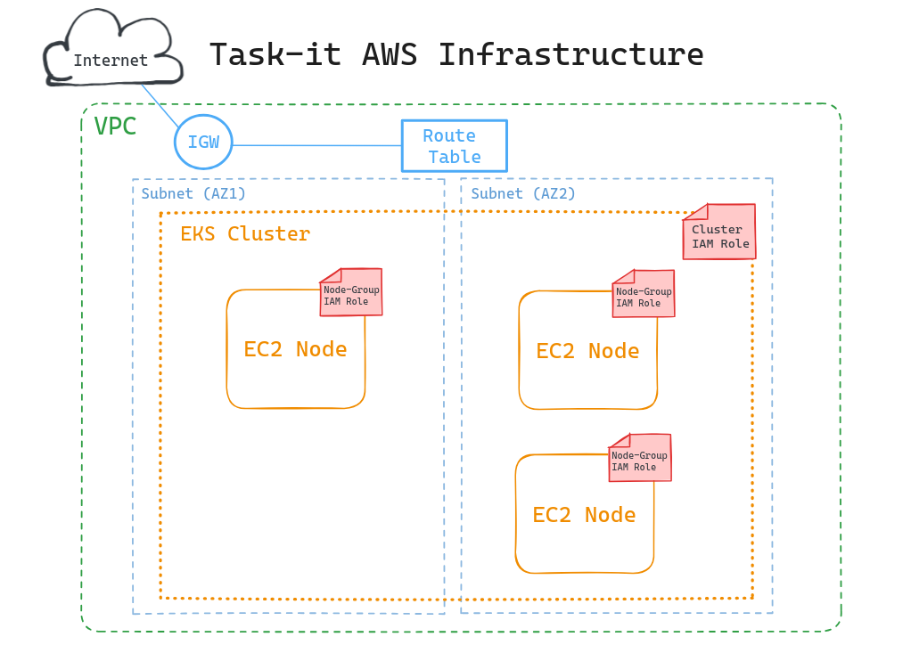

# Task-it Terraform IaC - EKS on AWS

This repository contains Terraform Infrastructure as Code (IaC) for deploying an Amazon EKS (Elastic Kubernetes Service) cluster on AWS.  
The infrastructure is designed to support the deployment of the Task-it application using Kubernetes.

## Prerequisites

Ensure you have the following prerequisites before getting started:

- [Terraform](https://www.terraform.io/) installed
- AWS account and appropriate credentials configured
- AWS CLI installed for authentication and configuration

## Terraform Modules

- **`network/`** - Creates the VPC for the cluster.
- **`security/`** - Creates the necessary IAM roles for the cluster.
- **`eks/`** - Deploys the EKS cluster, a node group, and required add-ons.
- **`k8s/`** - Applies required kubernetes resources for bootstrapping the Task-it application via ArgoCD.
- **`main.tf`** - Main module.

## Configuration

1. Set an S3 bucket as the backend in `providers.tf`:

```
terraform {
  required_providers {
    aws = { ... }
  }

  backend "s3" {
      bucket = "your-bucket"
      key = "some-key-for-state-file"
      region = "your-bucket-region"
  }
}

provider "aws" { ... }
```

2. Update variables using your own `terraform.tfvars` to configure the project:

```sh
owner_tag = "your.name"
bootcamp_tag = <number-over-19>
expiration_date_tag = "01-01-2099"

# main.tf
name_prefix = "custom-prefix"
instance_type = "node-group-instance-type"
apply_k8s_module = true
...
```

## Deployment

1. Initialize Terraform:

```sh
terraform init
```

2. Deploy Terraform:

```sh
terraform apply
```

## Architecture

When deploying this project we get the following architecture:



#### Network

- **Virtual Private Cloud (VPC)**
- **Internet Gateway (IGW)** - Internet Access for the VPC.
- **Route Table** - Associated with both subnets and directing outbound traffic to IGW.
- **2 Public Subnets** - Separate availability zones.

#### Security

- **Cluster IAM Role** - AWS managed policy `AmazonEKSClusterPolicy` attached.
- **Node Group IAM Role** - Applied on managed nodes / instances with necessary privilages.

#### EKS

- **Cluster** - AWS managed Kubernetes cluster.
- **Node Group** - Single node group with variable scale and instance type.
